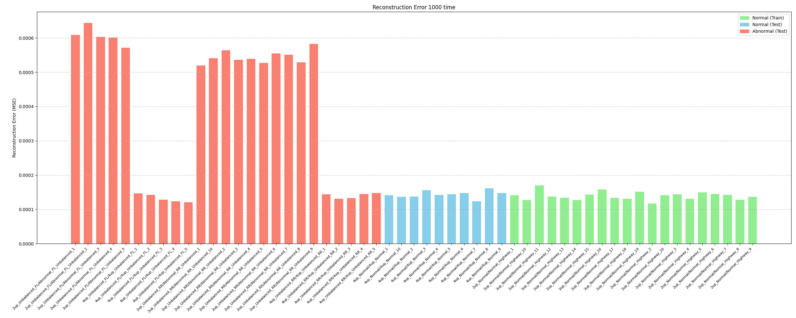
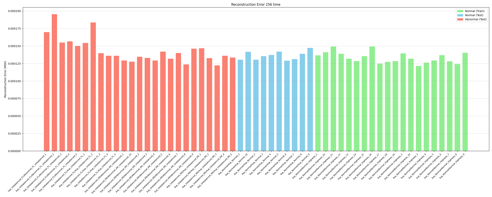
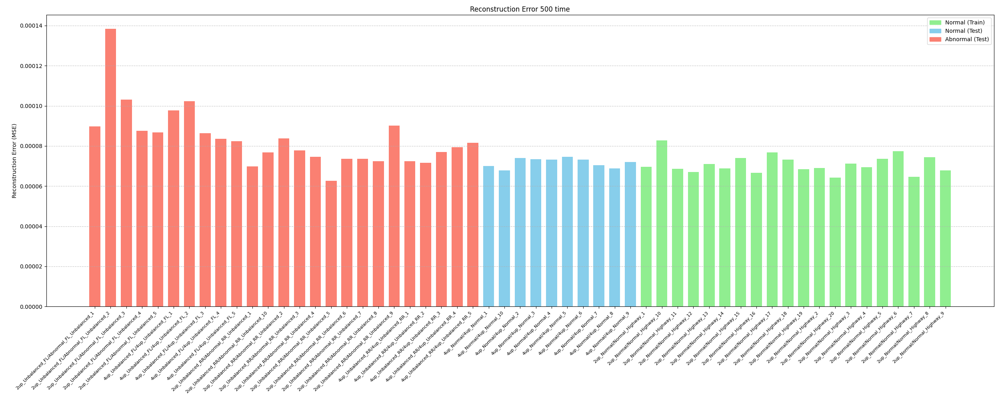
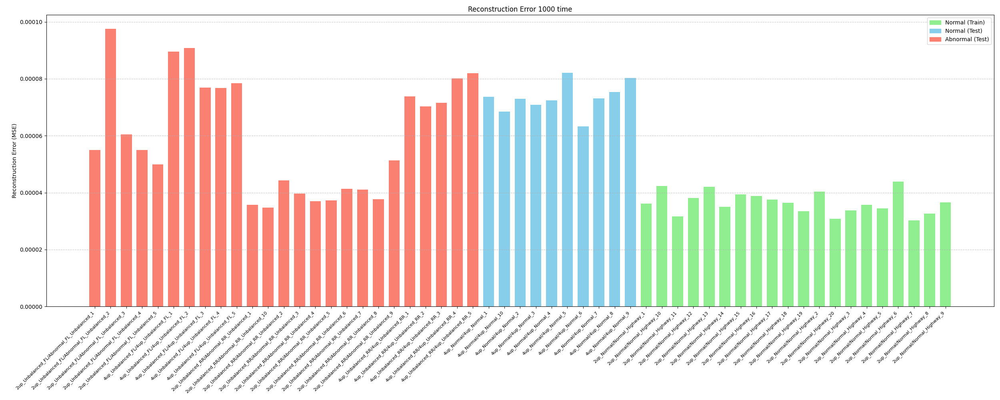

# 타이어 언밸런스

 

### 진행과정
- 현재까지 rawdata를 멜 스펙트로그램으로 변환한 뒤 평균을 낸 값을 눈으로 확인했다. FL_Unbalance 시나리오는 정상 시나리오와 비교했을때, 13Hz 대역에서 확실한 dB 차이를 보여주었다. 하지만 RR_Unbalance는 그렇지 않았으며, 그 외의 대역에서 정상 시나리오와 다른 패턴을 보였다.

- 그 후로는 각 파일별 멜 스펙트로그램을 출력하여 학습의 입력으로 넣어주었다. 모델은 멜 스펙트로그램의 이미지를 처리하기 때문에 2d Conv AE를 사용했다. 이때 128,256,500,1000 단위로 윈도우를 설정한 멜 스펙트로그램을 입력으로 사용했고, 총 4번의 학습을 진행했다.

    - 학습의 결과는 다음과 같다.

    
    *윈도우 128*

    
    *윈도우 256* 

    
    *윈도우 500*

    
    *윈도우 1000*

- 

### 정보 기록

  - 잔차(Residual): 모델이 예측한 값과 실제 데이터의 값 사이의 오차 또는 차이
    - 왜 중요한가? 
        - 1. 모델의 정확도 평가: 잔차가 작을수록 모델의 예측 정확도가 높다. 모든 잔차를 제곱하여 더한 후 평균을 내는 평균 제곱 오차는 모델의 성능을 평가하는 대표적인 지표이다.
        - 2. 모델의 편향성 확인: 만약 잔차들이 0을 중심으로 무작위로 흩어져 있지 않고 특정 패턴을 보인다면, 모델이 데이터를 제대로 학습하지 못했다는 신호이다. 
        - 3. 이상치(Outlier) 탐지: 다른 잔차들에 비해 유독 큰 값을 가지는 잔차는 해당 데이터 포인트가 이상치일 수 있음을 암시한다.

  - Residual Connection(잔차 연결): 신경망의 특정 블록에서 입력값 x를 몇 개의 층을 통과시킨 출력값 F(x)에 그대로 더해주는 것이다. 